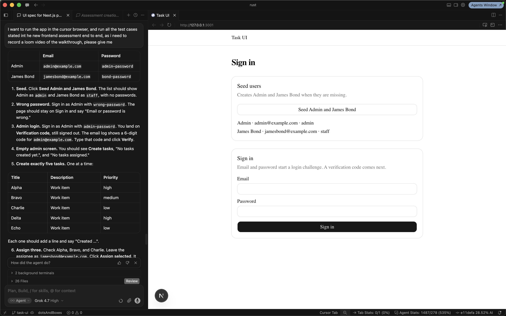
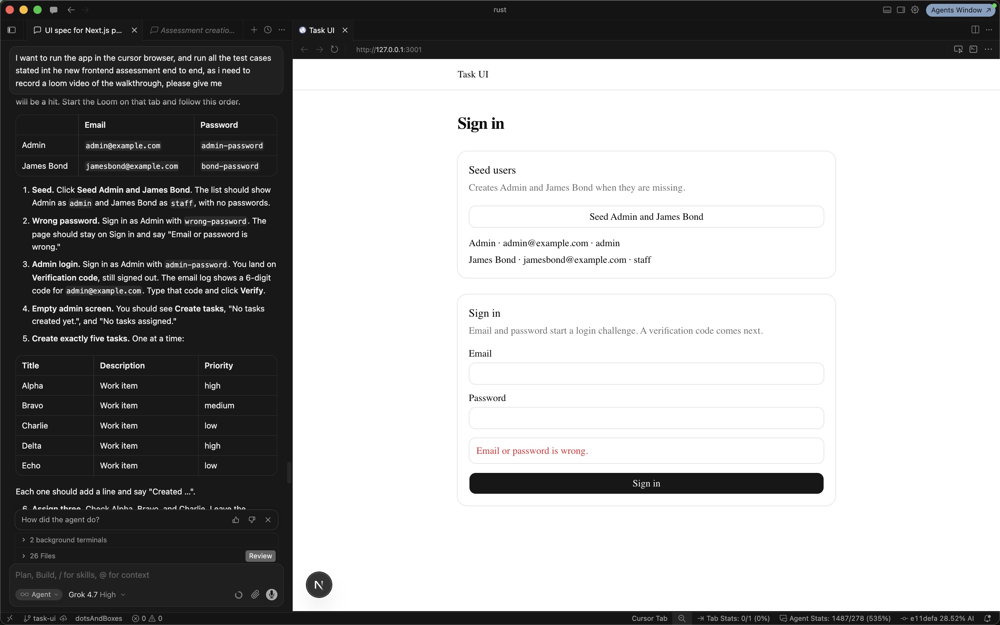
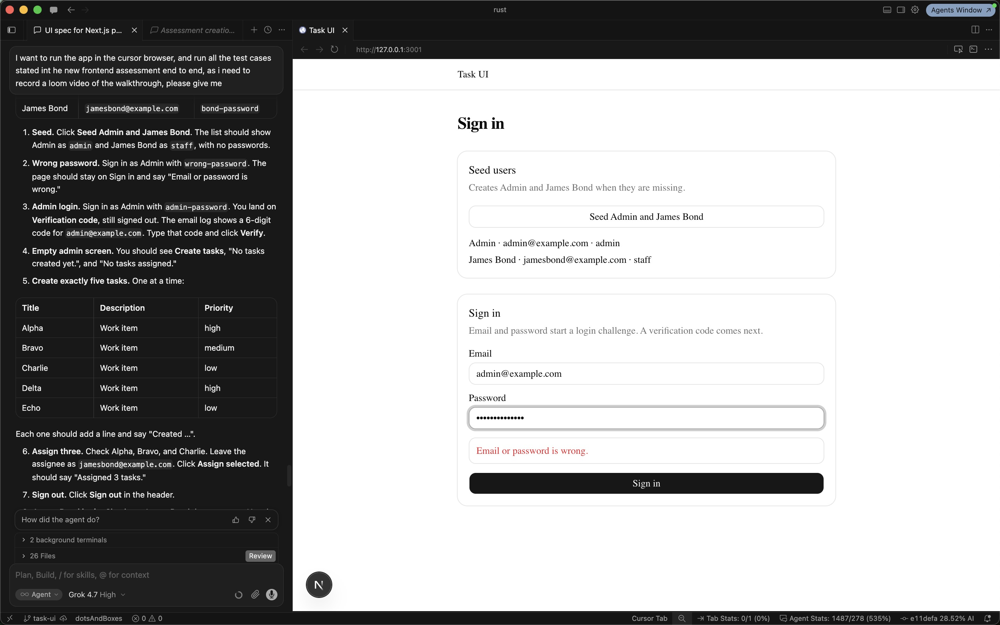
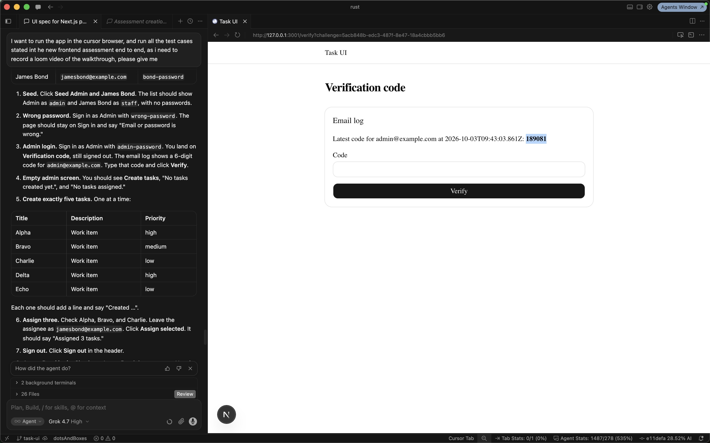
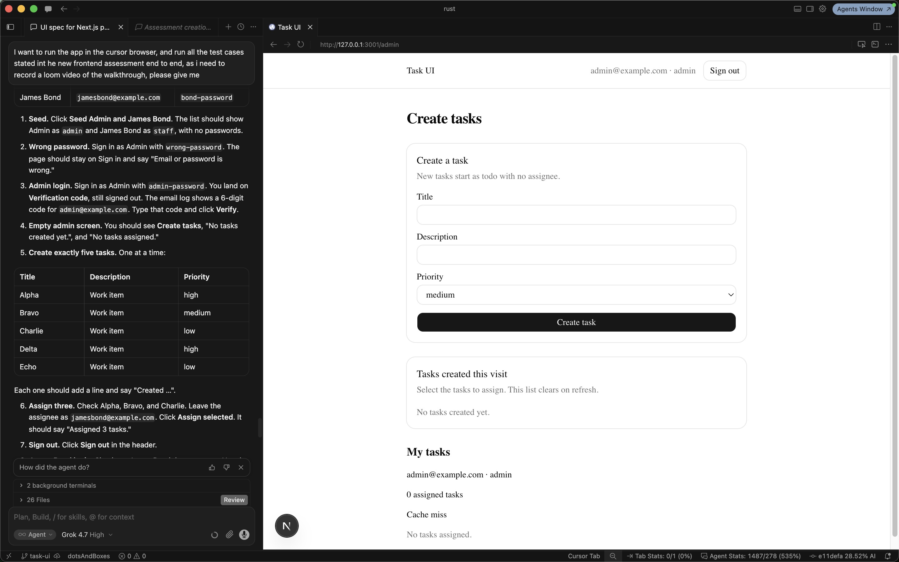
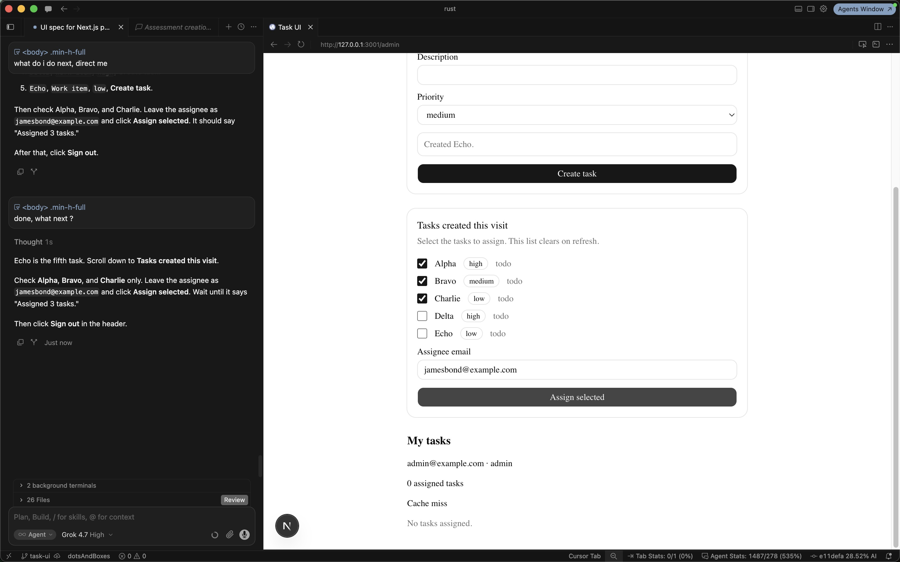
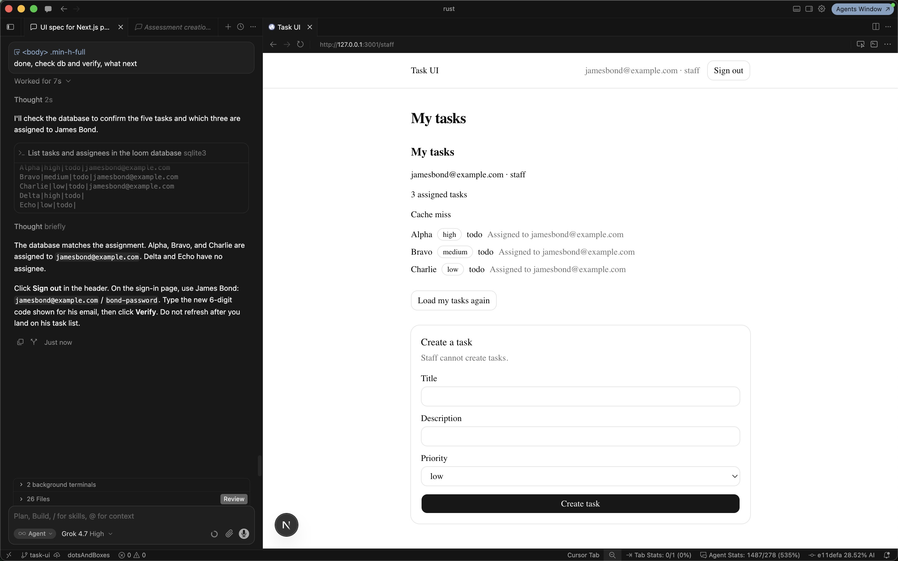
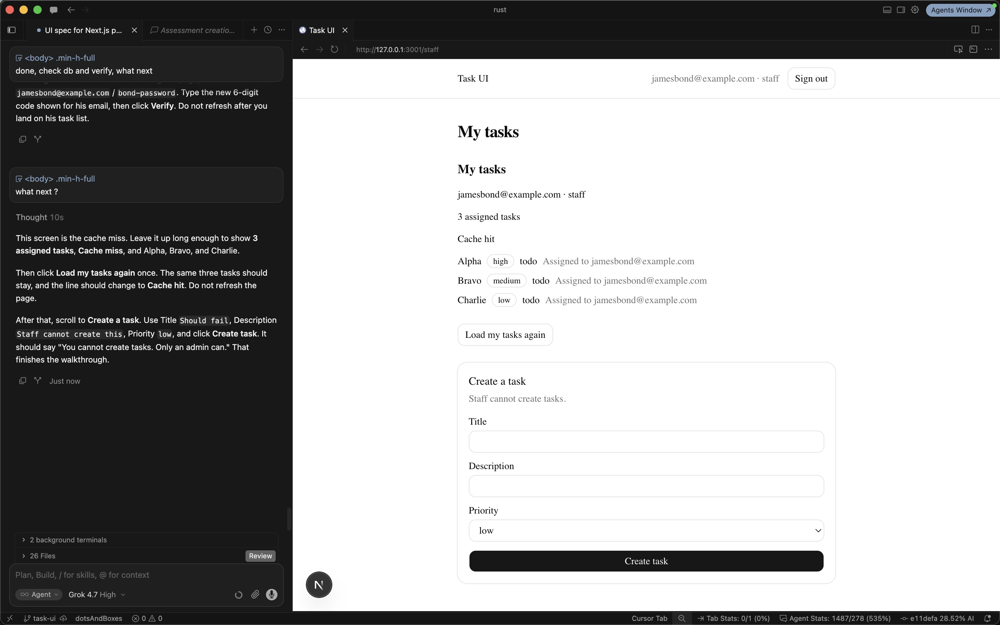
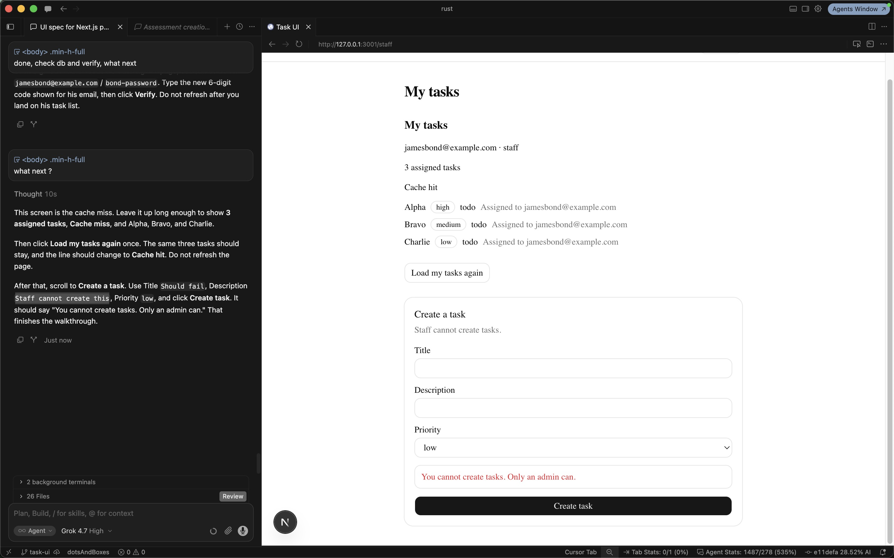
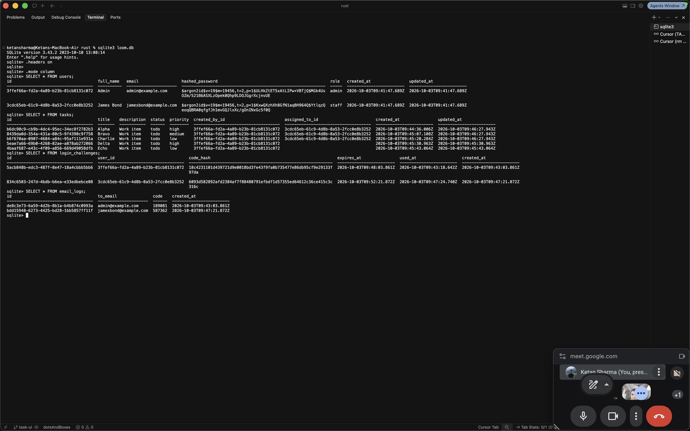

# Task API

Local task API for the assignment. Users, tasks, login challenges, and email logs are stored in one SQLite file. My tasks are cached in process memory. Verification codes are written to the email log. There is no email client.

## Setup

```bash
cp .env.example .env
```

Seed passwords are fixed:

- Admin: `admin@example.com` / `admin-password`
- James Bond: `jamesbond@example.com` / `bond-password`

## Migrations

`cargo run` applies the SQLx migrations in `migrations/` before it listens.

## Run

```bash
cargo run
```

The server listens on `PORT` (default `3000`).

## Seed

```bash
curl -s -X POST http://127.0.0.1:3000/seed/users \
  -H 'content-type: application/json' \
  -d '{}'
```

Calling seed again is safe. Existing users are left unchanged.

## Validation

1. Start login as Admin. The response is a `login_challenge_id` and does not include a session.

```bash
curl -s -X POST http://127.0.0.1:3000/auth/login \
  -H 'content-type: application/json' \
  -d '{"email":"admin@example.com","password":"admin-password"}'
```

2. Read the verification code.

```bash
curl -s http://127.0.0.1:3000/dev/email-logs/latest
```

3. Verify Admin and keep the `access_token`.

```bash
curl -s -X POST http://127.0.0.1:3000/auth/verify-2fa \
  -H 'content-type: application/json' \
  -d '{"login_challenge_id":"<id>","code":"<code>"}'
```

4. Create five tasks as Admin. Repeat with different titles and priorities (`high`, `medium`, `low`).

```bash
curl -s -X POST http://127.0.0.1:3000/tasks \
  -H "authorization: Bearer <admin token>" \
  -H 'content-type: application/json' \
  -d '{"title":"Alpha","description":"Work item","priority":"high"}'
```

5. Assign three of those task ids to James Bond.

```bash
curl -s -X POST http://127.0.0.1:3000/tasks/assign \
  -H "authorization: Bearer <admin token>" \
  -H 'content-type: application/json' \
  -d '{"task_ids":["<id>","<id>","<id>"],"assignee_email":"jamesbond@example.com"}'
```

6. Sign James Bond in the same way (login, latest email log, verify).

7. Creating a task as James Bond returns `403`.

8. `GET /tasks/view-my-tasks` with James Bond's token returns the three assigned tasks. The first response has `cache.hit` false. The same call again has `cache.hit` true.

## Frontend

The UI is a Next.js app in `ui/`. It calls this API. The browser does not call the API directly. The access token from verify is stored in an httpOnly cookie.

```bash
cd ui
cp .env.example .env.local
npm install
npm run dev -- --port 3001
```

Leave the API running on port 3000. Open http://127.0.0.1:3001. Seed the users, sign in, and read the verification code on the next screen. Admin creates tasks and assigns them. Sign out, then sign in as James Bond to see my tasks. "Load my tasks again" shows the cache hit. Creating a task as James Bond shows that staff cannot create tasks.

```bash
cd ui
npm run e2e
```

That starts the API on port 3099 with a fresh SQLite file and the UI on port 3100, then walks the validation flow in a browser.

The UI adds a browser path over the same API: seed both users, reject a bad password, finish a login challenge from the email log, create five tasks, assign Alpha, Bravo, and Charlie to James Bond, then show his my tasks as a cache miss, a cache hit, and a blocked create. `rounds/` is that walkthrough, one shot per step.

## Walkthrough

1. Sign-in at http://127.0.0.1:3001 after seed. Admin is `admin` and James Bond is `staff`. Passwords stay off the list.



2. A wrong Admin password stays on Sign in and says the email or password is wrong.



3. The Admin email and password are filled in for the real login. The previous rejection is still on the form until Verify.



4. Verification code reads the email log: a 6-digit code for `admin@example.com` (`189081` in this run). The session starts only after Verify.



5. Admin lands on Create tasks with an empty visit list. My tasks is a cache miss: 0 assigned tasks.



6. Alpha, Bravo, Charlie, Delta, and Echo exist. Alpha, Bravo, and Charlie are checked. The assignee is `jamesbond@example.com`. The line above the button says `Created Echo.`



7. James Bond is signed in as staff. My tasks lists those three, each assigned to `jamesbond@example.com`, and the line says cache miss.



8. Load my tasks again. The same three tasks stay, and the line says cache hit.



9. A staff create says `You cannot create tasks. Only an admin can.` The cache hit and the three tasks stay on the page.



10. `loom.db` matches the screens. `users` holds Admin and James Bond with Argon2 hashes. `tasks` holds five rows; Alpha, Bravo, and Charlie point at James Bond, and Delta and Echo have no assignee. `login_challenges` stores code hashes. `email_logs` stores the plaintext codes, including James Bond's `587362`.



## Tests

```bash
cargo test
```

The tests call the HTTP API against a temporary SQLite file. A test-controlled clock expires verification codes without waiting five minutes.

## Cache

The my-tasks cache is an in-memory map, one entry per user, with no expiry. It is not shared across processes. Assignment and task updates drop the affected users' entries.

## Final `GET /tasks/view-my-tasks` response

This body is from a local run as James Bond after three tasks were assigned. Ids change on each run. `cache.hit` was `false` on this first read and `true` on the immediate repeat.

```json
{
  "user": {
    "email": "jamesbond@example.com",
    "role": "staff"
  },
  "tasks": [
    {
      "id": "d538d6c0-b20a-4ec0-8efc-107b7ea31e88",
      "title": "Alpha",
      "status": "todo",
      "priority": "high",
      "assigned_to": "jamesbond@example.com"
    },
    {
      "id": "f06727b4-7e11-4416-8960-1c97f9721a8e",
      "title": "Bravo",
      "status": "todo",
      "priority": "medium",
      "assigned_to": "jamesbond@example.com"
    },
    {
      "id": "a74e1f80-dc3e-4e1b-b8a1-9db4c503bab0",
      "title": "Charlie",
      "status": "todo",
      "priority": "low",
      "assigned_to": "jamesbond@example.com"
    }
  ],
  "summary": {
    "total_assigned_tasks": 3
  },
  "cache": {
    "hit": false
  }
}
```
